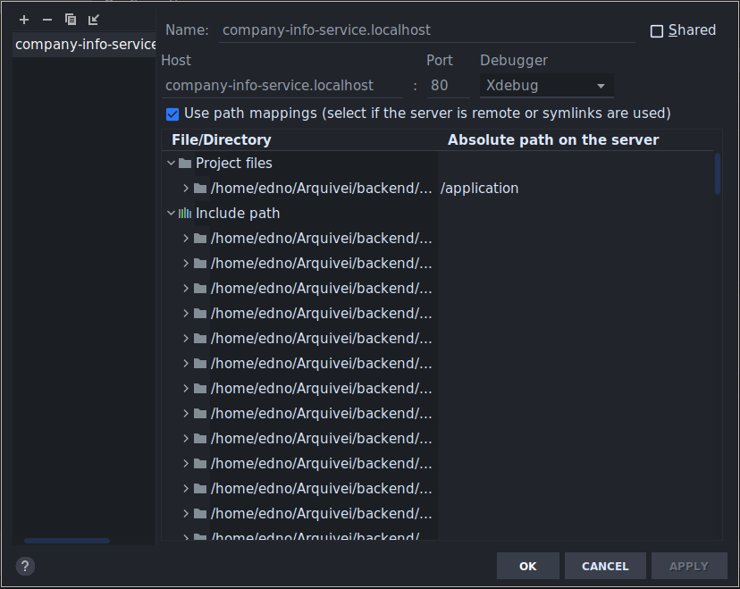

# SAP Integration

Backend da integração com SAP

## Requisitos

+ Make
+ Docker engine (Versão >= 20)
+ Docker compose

## Setup Inicial

Clone esse repositório e execute o comando `make` na raiz do projeto:

Esse comando configura os containers de desenvolvimento no Docker, instala as dependências do projeto, faz a migração do
banco de dados, executa os testes unitários e de integração e realiza a análise estática do código com `phpstan`.

## Utilitários

Na pasta `bin` estão localizados scripts utilitários que fazem wrapper das imagens docker do projeto para facilitar o
teste da aplicação. Os comandos disponíveis são:

* `bin/php`
* `bin/phpdbg`
* `bin/composer`

## Debugging no PHPStorm

O PHP-FPM já tem o XDebug habilitado, mas é necessário seguir os seguintes passos para configurar o debugger no
PHPStorm:

1. Importe a configuração da pasta `.run`
2. Crie uma configuração de _server_ com nome e host `sap-integration.localhost` e _server mapping_ para `/application`.

   

3. Inicie a escuta do debug pela IDE
4. Execute as ações com o comando `bin/phpdbg` ou através da IDE
